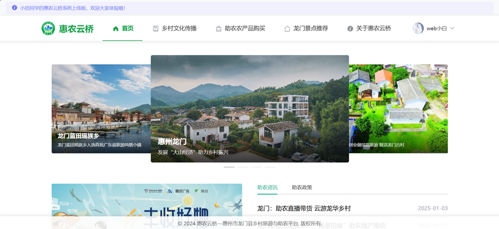
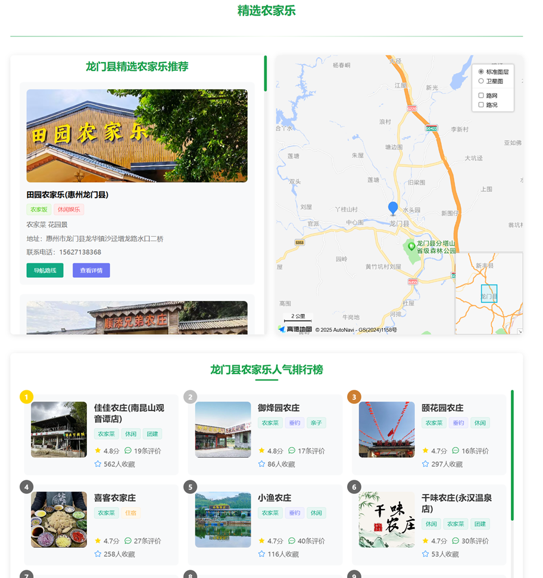
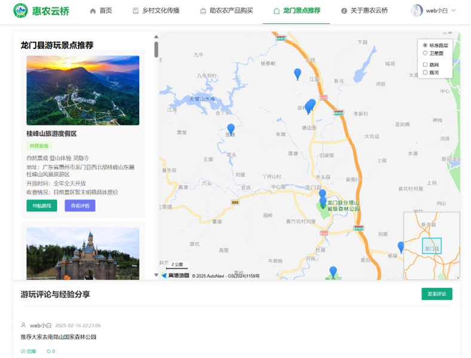
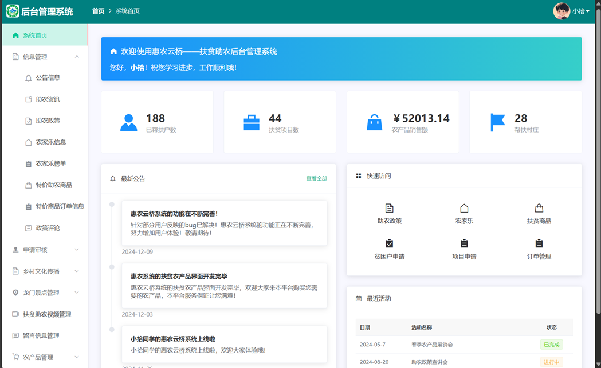

# Huinong-Bridge惠农云桥 - 乡村振兴数字化助农平台
## 项目简介
（本项目是自己初学前端开发和Web开发的一个项目，技术不强，但也是我自己一个人从零开始搭建的，边学知识边做，技术不精！）惠农云桥是一个专注于乡村振兴和农产品销售的综合性平台，旨在帮助农民提高农产品销售渠道，促进农村经济发展。平台集成了农产品展示、销售、农业资讯等多个功能模块，为农户和消费者搭建起便捷的信息互通桥梁。

## 项目展示

### 前台页面展示
<table>
  <tr>
    
    
  </tr>

  <tr>
  </tr>

  <tr>
    <td></td>
    <td></td>
  </tr>
  <tr>
    <td></td>
    <td></td>
  </tr>
  <tr>
    <td></td>
    <td></td>
  </tr>
  
</table>

### 后台管理系统
<table>
  <tr>
    
  </tr>
</table>


### 主要功能
- 非遗文化展示
- 后台管理系统
- 订单管理
- 农家乐推荐
- 景点推荐
- 农产品购买展示
- 乡村文化传播与助农微视频
- 助农政策、资讯发布
- 数据统计与分析
- 地图定位服务

## 技术栈

### 前端技术
- Vue.js 2.6.14
- Element UI 2.15.14
- Vue Router 3.5.1
- Axios 用于HTTP请求
- 高德地图API集成
- WangEditor富文本编辑器
- Excel导出功能（xlsx）

### 后端技术
- Spring Boot 2.5.9
- MyBatis
- MySQL数据库
- JWT认证
- Hutool工具集
- PageHelper分页插件

## 环境要求
- Node.js 12.x 或以上
- JDK 1.8
- MySQL 5.7 或以上
- Maven 3.6.x 或以上

## 项目运行

### 数据库配置
1. 创建MySQL数据库
2. 导入项目根目录下的`countryside_project.sql`文件

### 后端运行
1. 进入springboot目录
```bash
cd springboot
```
2. 修改`application.yml`中的数据库配置
3. 使用Maven安装依赖并运行
```bash
mvn clean install
mvn spring-boot:run
```

### 前端运行
1. 进入vue目录
```bash
cd vue
```
2. 安装依赖
```bash
npm install
```
3. 启动开发服务器
```bash
npm run serve
```
4. 访问 http://localhost:8080

## 项目部署
### 前端打包
```bash
cd vue
npm run build
```
生成的文件位于`dist`目录下

### 后端打包
```bash
cd springboot
mvn clean package
```
生成的jar文件位于`target`目录下

## 注意事项
- 确保MySQL服务已启动
- 前端开发端口默认为8080，后端API端口默认为9090
- 首次运行需要导入数据库文件
- 建议使用Chrome浏览器访问系统 
